# HPC 学习笔记：01 Introduction

- 来源-> (https://missing.lcpu.dev/basic/01-introduction)

# 2 🔍和知识获取

## 如何搜索?
使用baidu->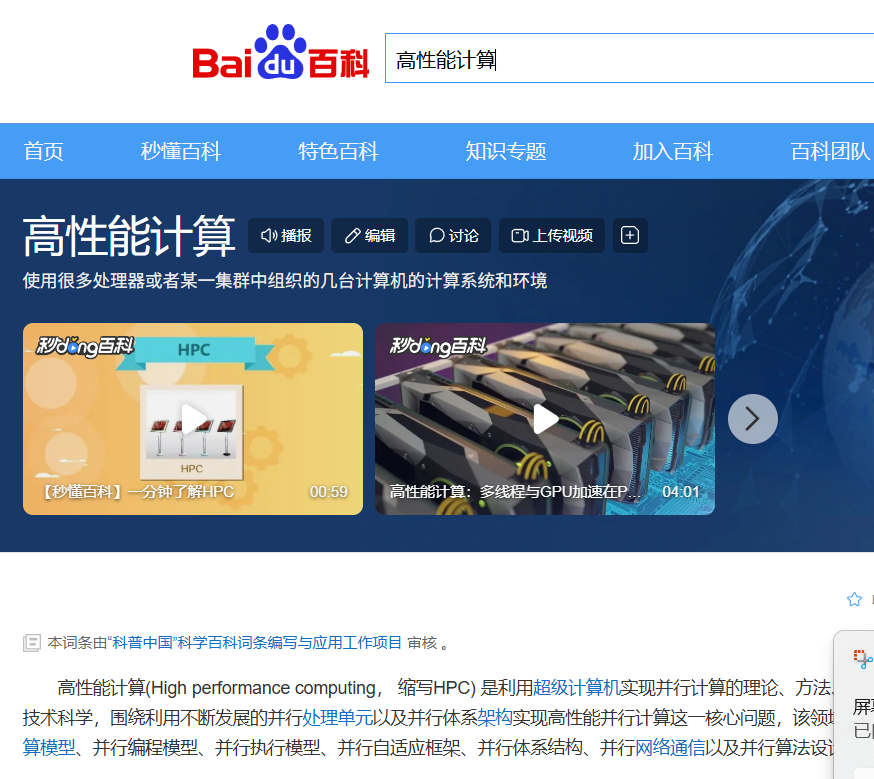
使用microsoft edge->

# 试一试
利用关键词找到The Rust网站->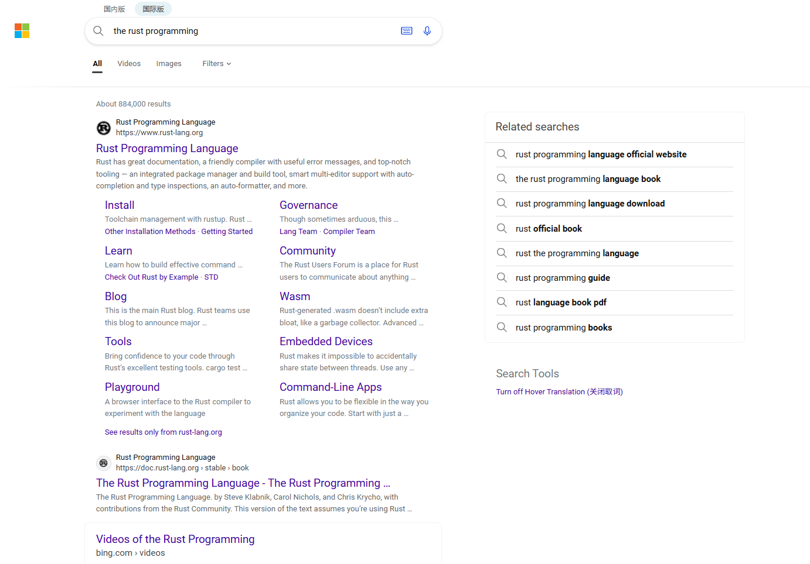

## 信息平台
- 官方文档
Python official web->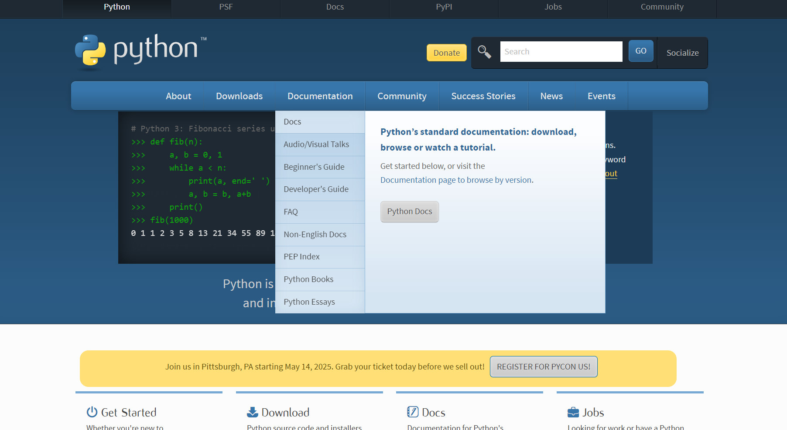
利用man命令查看->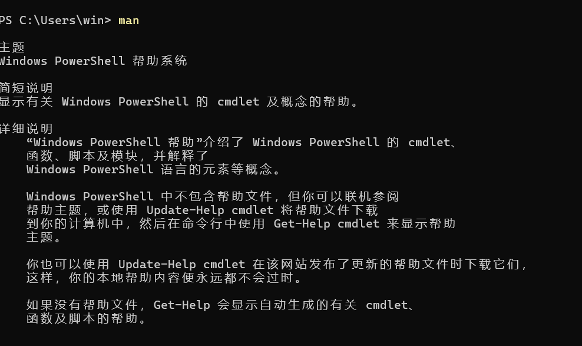
利用man man->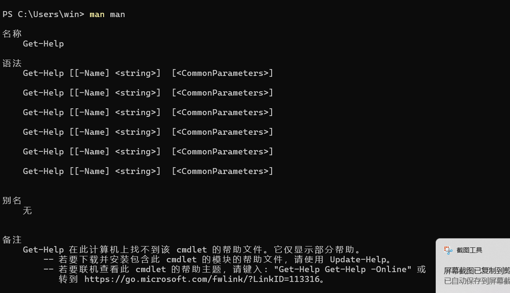
(点后面的意思是man 手册页的章节编号)

# 试一试
Latex Documentation->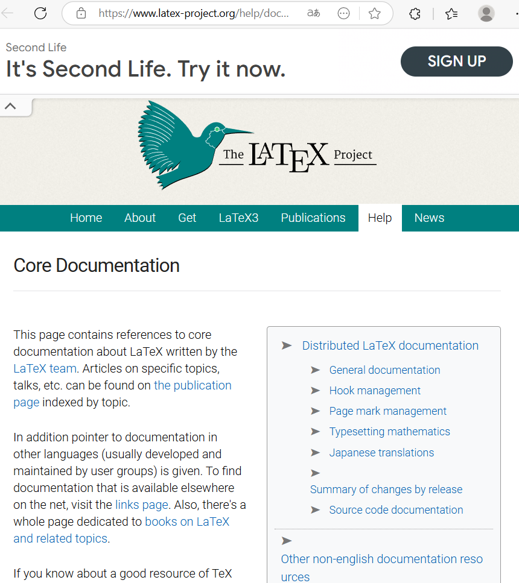
Latex Simple Documentation->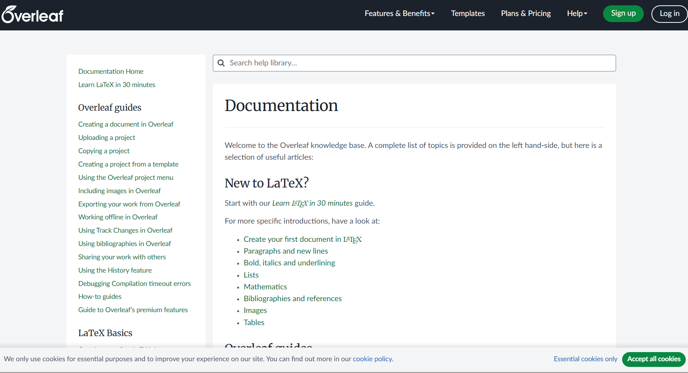
修改目录栏->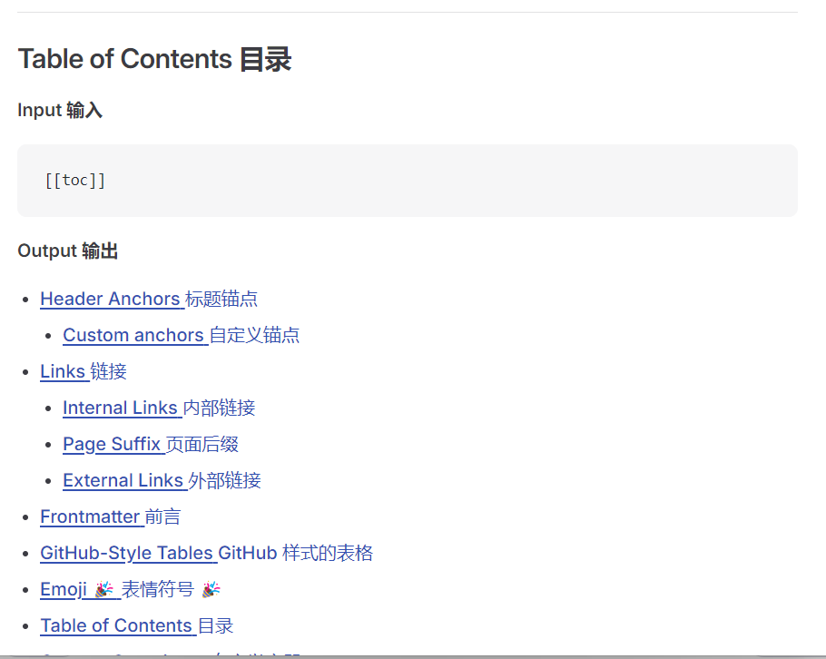

# 3 计算机基本知识概览 I：软硬件和操作系统

## 为什么要学习命令行工具？
- 图形化界面（GUI）虽然易用，但命令行（CLI）提供了更强大的自动化与批处理能力。
- 高性能计算（HPC）、服务器管理、数据处理等领域通常只提供命令行接口。

## 计算机组成：软硬件基础

### 硬件部分
- **处理器（CPU）**：负责运算与控制。
- **内存（RAM）**：临时数据存储区域，速度快，断电即失。
- **存储（硬盘/SSD）**：长期保存数据。
- **外设**：显示器、键盘、鼠标、打印机等。

### 软件部分

- **系统软件**：如操作系统（Windows、Linux、macOS）。
- **应用软件**：如浏览器、文档编辑器。
- **开发工具**：编译器、解释器、调试器等。

## 🖥️ 操作系统的角色

- 操作系统是用户和硬件之间的中介，主要功能：
  - 管理资源（内存、CPU、I/O 设备）
  - 提供用户界面（图形或命令行）
  - 调度进程，处理文件系统
  - 控制权限、安全性等

## 学会使用手册：`man`

- Linux 系统中使用 `man` 命令查看命令手册：
  - `man ls`：查看 `ls` 命令说明
  - `man 2 signal`：查看 signal 系统调用（章节 2）
  - `man 7 signal`：查看 signal 的概念介绍（章节 7）

# 4 计算机基本知识概览 II：计算机的评价

## 计算机的评价：过去、现在与未来

## 衡量计算机的指标 —— 面向最终交付的评价

### 能耗与功耗

- **功耗**：单位时间内芯片消耗的能量。
- **能耗**：完成单位工作所需的能量。
- 对比不同设备时，能耗指标更能体现效率，功耗更多用于设计约束。

#### 实际问题
- 过高功耗：手机发热、笔记本降频、服务器散热瓶颈等。
- 边际效益递减：高功耗不一定带来线性收益。

---

### 性能

- 性能 = 指令数 × 每条指令执行时间
- 与 IPC（每周期指令数）、频率、架构密切相关。
- 不同架构间指令数可能差异巨大。

#### 基准测试（Benchmark）

- 常见工具：Geekbench、Passmark、Spec2017、Cinebench、Blender 等
- 注意避免对抗性优化，理解 Benchmark 的局限性
- 软件优化（如向量化、并行）也能大幅提升性能

#### GPU 的例子

- 高并行任务表现优异（如深度学习、视频处理）
- 对不适配任务几乎无法运行，强调“针对性设计”的重要性

---

### 成本

- **制造成本**：设备本身的采购及研发成本
- **运作成本**：电费、空间、冷却、维护等
- **利润**：创造价值 ÷ 成本 - 1

#### 实际应用中的取舍

- 深度学习 vs 存储型需求：投资方向不同
- 成本 = 整体系统级考量，而非单个部件

---

## 生态系统

- 并行性成为提升性能的关键
- 工具：SIMD、OpenMP、多线程、GPU 加速（如 CUDA）
- 程序员对系统的理解成为性能的决定因素
- 架构黏性：主流架构生态完善，冷门架构缺乏文档和支持

# 5 用好你的电脑 I 环境配置，常用软件选择、安装与卸载

————————————————————————————————————

# 6 用好你的电脑 II

## 版本控制概览

版本控制系统是用来管理和跟踪软件源文件版本的系统，分为中心化和去中心化两种工作方式。中心化版本控制需要有一个服务器，例如 SVN；去中心化版本控制中，每个人均拥有完整的版本记录，Git 是其代表作。

## Git 的基本理念

Git 把项目历史看成一个有向无环图。每个提交是一个节点，可以追溯历史。Git 有三个区域：工作区，暂存区，版本库，操作流程为修改－>暂存－>提交。

## Git 的基本使用

# 初始化仓库

- mkdir git-example
- cd git-example
- git init

# 配置 Git

- git config --global --edit
- \[
- \[user]
- name = 自己名字
- email = 邮箱
- ]

# 暂存修改

- echo Hello, world! > example1.txt
- git add .
- git status

# 提交修改

- git commit -m "My first commit"
- git status
- git commit -am "message" 可自动暂存已修改或删除文件，但不包括新文件

# 查看和回退历史版本

-echo Hello, Git! > example1.txt
-git commit -am "My second commit"
- git log
- git checkout 版本hash
- cat example1.txt
- git checkout master
- git reset --hard 版本hash

- 排除指定文件

- mkdir confidential
- echo Password is not a good password > confidential/password.txt
- echo This is pretend to be a object file > main.o
- echo confidential
- \*.o > .gitignore
- git add .
- git commit -m "add .gitignore"

- 分支管理

- 创建分支：
- git checkout -b update-example 37f7d
- echo Hello, Git2! > example1.txt
- git commit -am "Branch!"

- 变基分支：
- git rebase master
- git checkout master

- 合并分支和冲突解决

- git checkout -b merge-example
- echo Lorem ipsum > example2.txt
- echo Hello, Git6! > example1.txt
- git add example2.txt
- git commit -m "Prepare to merge"
- git checkout master
- git merge merge-example

- 如有冲突：
- 手动修改 example1.txt 中的 <<<<<<< ======= >>>>>>> 部分
- 如: Hello, Git8!
- git add .
- git merge --continue

## 同步使用 Git 服务器

# 克隆仓库：
- git clone url://path/to/be/cloned

# 拉取代码：
- git pull

# 推送代码：
- git push

# 分叠与 PR/MR

# 无# 写权可分叠 fork，开发后提交 PR/MR

# 合并方式：

1. 合并：保留所有历史，有多个父节点
2. 变基：重新应用修改，历史更简洁
3. squash：历史压缩成一次提交

# 图形化工具

# VSCode：内置 Git 管理

- 同时可考虑 gitg（GNOME）、kommit（KDE）

# 7 用好你的电脑 III：故障自查与知识串讲

硬件资源监控笔记

## 一、硬件资源信息查看

1. 磁盘信息

* 查看磁盘占用：Windows 和 Linux 文件管理器
* 查看磁盘健康：

  * Linux：smartctl 命令
  * Windows：CrystalDiskInfo 软件->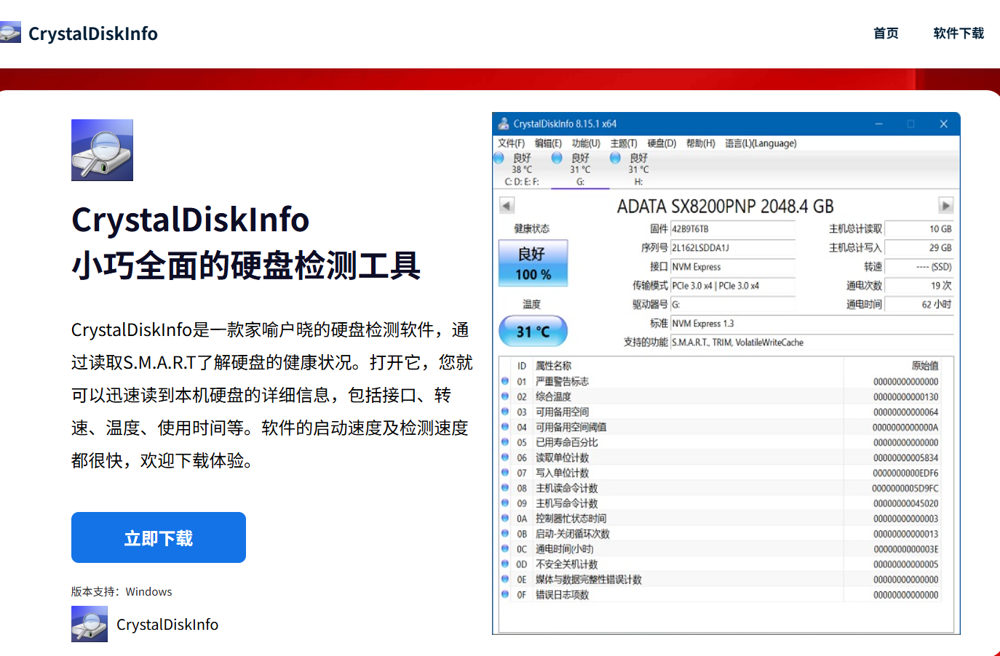

2. 处理器与内存信息

* Windows：任务管理器（Ctrl+Shift+Esc）
* Linux：btop 程序

3. 电池信息

* Windows：powercfg 命令生成电池报告（HTML 格式）
* Linux：upower 命令

## 二、常见故障自查

1. 蓝屏（BSOD）

* 原因：驱动异常、关键进程退出、硬件故障等
* 解决办法：进入安全模式卸载驱动、查杀病毒、查看内核转储文件（WinDbg）

2. 内核恐慌（Linux）

* 原因：驱动错误、1 号进程退出
* 解决办法：卸载驱动，与开发者沟通，检查内核日志

3. 应用软件崩溃

* 原因：软件 Bug、使用方式或系统环境问

4. 系统启动慢

* Windows：检查启动项，任务管理器禁用
* Linux：使用 journalctl 查看日志，禁用慢服务

5. 应用程序运行慢

* 检查 CPU、内存占用
* 检查网络连接（网络 IO）
* 检查磁盘健康状态（磁盘 IO）

6. 网络连接故障

* 检查：网线、路由器、电信账户、DNS 设置、代理状态
* Linux：rfkill 和 ip 命令检查适配器状态

# 8 用好你的电脑 IV

## 什么是 URL

URL 结构：协议 + 域名 + 路径 + 查询参数。

查询字符串以 ? 开头，由 key=value 组成，用 & 连接多个参数。

分享链接时可删除 ? 后的部分，防止隐私泄露。

## 隐私保护

## 简单安全措施

## 警惕钓鱼与伪造网站

## 代理与 VPN（Virtual Private Network）

- 代理：浏览器通过代理服务器请求内容，保护隐私、加速访问。

- 服务端代理：缓存、负载均衡、安全屏障。

- VPN：加密传输通道，实现远程安全访问专用网络。

- 风险：使用代理/VPN 意味着中间节点可见流量，需谨慎。

# 9 用好你的电脑 V

## 什么是操作系统

- 操作系统是管理计算机软硬件资源，并提供用户与其他软件接口的基础软件。

- 它建立了一个抽象层，使程序员不必直接面向硬件开发。

- 操作系统实现了如并发执行、错误处理、资源管理等复杂功能，提升了开发效率与系统安全性。

## 用户界面类型

- CLI（命令行界面）：

- 通过键盘输入命令与系统交互。

- 优点：性能消耗低，适合远程操作。

- TUI（终端用户界面）：

- 以字符构建交互界面，功能更丰富。

- 例如：Vim 编辑器。

- GUI（图形用户界面）：

- 使用图标、菜单和鼠标交互，直观易用。

- 适用于日常办公和大部分用户需求。

## 集成开发环境与文本编辑器

- IDE（集成开发环境）：如 Visual Studio、Pycharm，功能丰富，集成编译器、调试器等工具。

- 文本编辑器：如 VSCode、Vim，轻量简洁，可通过插件增强功能。

- VSCode 支持插件如 Code Runner，可作为轻量 IDE 使用。

## 命令式语言

- 以 C/C++、Python 为代表，通过修改变量状态和控制流程表达计算。

- 与函数式语言（如 Haskell）相比，结构更直观，易于上手。

## 编译型语言与解释型语言

- C/C++：编译型语言，通过编译器翻译为可执行文件，效率高。

- Python：解释型语言，逐行执行，灵活但效率低。

- 编译器能捕捉更多语法与语义错误，解释器则在运行时发现错误。

- 示例：Python 的灵活性与库支持使其适合小型项目。

## - 如何阅读报错与调试代码

# 错误类型：

- 语法错误、语义错误、逻辑错误。

- 编译器/解释器报错信息：

- 提示错误位置与类型，需细读报错上下文。

# Debug 技巧：

- 使用调试器或 print 语句跟踪代码执行。

- 缩小错误范围，定位问题模块与语句。

- 检查边界条件，编写测试数据。

# 10 Linux 与服务器介绍与基本使用 I

- 跑一个sl小火车->!sudo apt update
                 sudo apt install -y sl
                 sl
                 [alt text](image-10.png)

## 问题

- /proc 是什么？
  Answer:/proc 是一个虚拟文件系统，不是实际存储在磁盘上的，而是内核实时生成的。它提供了关于系统内核、进程以及硬件状态的各种信息。

          你可以在 /proc 中找到：

          每个运行中的进程信息（如 /proc/1234 是 PID 为 1234 的进程目录）

          系统内存信息（如 /proc/meminfo）

          CPU 信息（如 /proc/cpuinfo）

          内核参数配置（如 /proc/sys）
- /dev 是什么？

- /dev 是设备文件目录，用于表示系统中的各种硬件设备。

- Linux 遵循“一切皆文件”的理念，硬盘、鼠标、终端、USB 等设备都以文件形式暴露在 /dev 中。例如：

- /dev/sda：第一个SATA硬盘

- /dev/tty：终端设备

- /dev/null：黑洞设备（丢弃输出）

- 哪个文件可以查看 CPU 核心频率？

  /proc/->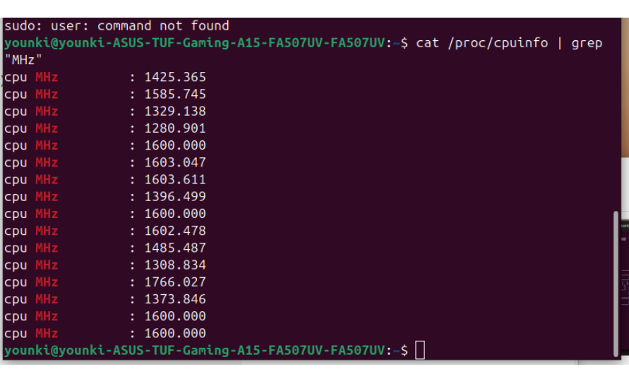
        ->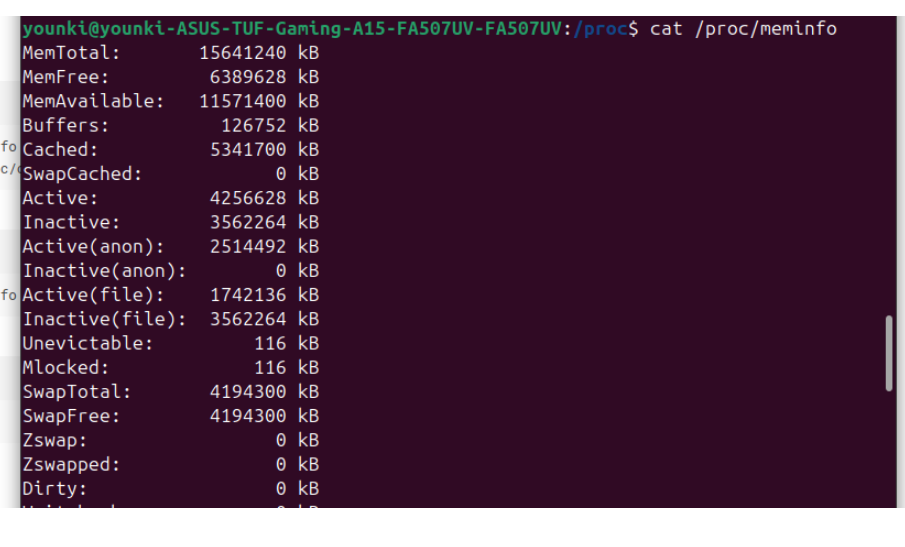

## 试一试

- 用 python 创建一个sum程序->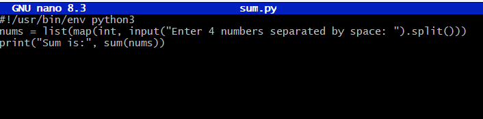

# 11 Linux 与服务器介绍与基本使用 II

（已安装）

# 12 文本编辑: Markdown 和 Typst

 (已阅读)